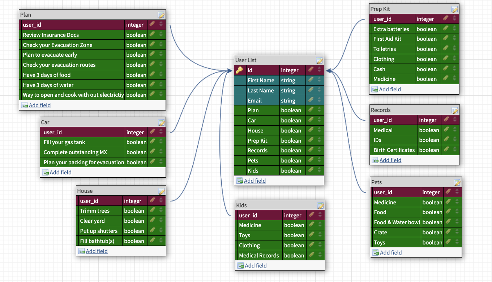

[![Contributors][contributors-shield]][contributors-url]
[![Forks][forks-shield]][forks-url]
[![Stargazers][stars-shield]][stars-url]
[![Issues][issues-shield]][issues-url]

<!-- PROJECT LOGO -->
 

  

  <h1 align="center">West FL WX</h3>

  <h3 align="center">
    Get the info you need in severe weather!
  </h3>

<!-- TABLE OF CONTENTS -->
<h3>
  

    
Table of Contents

    <ol>
      <li>
        <a href="#about-the-project">About The Project</a>
        <ul>
          <li><a href="#heroku-information">Heroku Information</a></li>
          <li><a href="#built-with">Built With</a></li>
          <li><a href="#database-schema">Database Schema</a></li>
        </ul>
      </li>
      <li>
        <a href="#getting-started">Getting Started</a>
        <ul>
            <li><a href="#repositories">Repositories</a></li>
            <li><a href="#front-end-repository-installation">Front-End Repository Installation</a></li>
            <li><a href="#endpoints">Endpoints</a></li>
        </ul>
      </li>
      <li><a href="#roadmap">Roadmap</a></li>
      <li><a href="#contact">Contact</a></li>
      <li><a href="#acknowledgments">Acknowledgments</li>
      <li><a href="#license">License</a></li></a>
    </ol>
  

</h3>

<!-- ABOUT THE PROJECT -->
## About The Project

Getting reliable information in an emergency is critical to your safety. West FL WX is a service that seeks to collect the most up-to-date weather forecast, road conditions, and emergency information from your local leaders. This information will be sent to you via e-mail so it can be saved on your local device in the event of power or internet outages. This will ensure you always have the information you need in an emergency.

(<a href="#top">back to top</a>)

<!-- Heroku Information -->
### Heroku Information

<b>To start, visit the link below and login or register:</b>

* <a href="https://calm-peak-36563.herokuapp.com/">https://calm-peak-36563.herokuapp.com/</a> 

<b>The back-end application is hosted separately at the link below, although it offers no end-user interactions:</b>

* <a href="https://stormy-harbor-06090.herokuapp.com/">https://stormy-harbor-06090.herokuapp.com/</a> 

(<a href="#top">back to top</a>)

### Built With

West FL WX is a Rails web application and e-mail service.

(<a href="#top">back to top</a>)

<!-- Database Schema -->
### Database Schema

The West FL WX application utilizes a one-to-many relationship to organize the user's essential areas of preparation.

(<a href="#top">back to top</a>)

<!-- GETTING STARTED -->
## Getting Started

West FL WX is deployed on Heroku utilizing two applications. The front-end application allows the user to login using Google OAuth, interact with the interface, and holds the database of user information. The back-end application handles the mailer and API calls.

<!-- Repositories -->
### Repositories

* <b>Front-End:</b> https://github.com/Consultancy-2208/west_fl_wx_fe  
* <b>Back-End:</b> https://github.com/Consultancy-2208/west_fl_wx_be  

(<a href="#top">back to top</a>)

<!-- Front-End Repository Installation -->
### Front-End Repository Installation

<b>Instructions:</b>
1. Fork and clone repository
1. `bundle install`
1. `bundle exec figaro install`
1. `rails db:{drop,create,migrate}`
1. Set up a project and product via Google Console and set up credentials for OAuth 2.0. Refer to <a href='https://support.google.com/cloud/answer/6158849?hl=en#:~:text=Go%20to%20the%20Google%20API,the%20scopes%20your%20project%20uses'>documentation</a> for complete instructions.
1. Make sure to have profile and email selected in the scopes when setting up Google OAuth, edits can be made from the OAuth consent screen.
1. Under credentials: add <a href='http://localhost:3000/auth/google_oauth2/callback'>http://localhost:3000/auth/google_oauth2/callback</a> as an authorized redirect URI.
1. Add your `Google Client ID` and `Google Secret ID` found in the credentials section in APIs and services to `config/application.yml`
1. In `app/services/west_fl_wx_service.rb` uncomment line 11, and comment line 12. Reverse this for production deployment.
1. Set up back-end repository (linked above).
1. Start both servers (in terminal: `rails s`).
1. Visit: `localhost:3000/` in your browser and have fun!

(<a href="#top">back to top</a>)

<!-- Endpoints -->
### Endpoints

The back-end application ties all functionality into a single endpoint request. To access, send a `POST` request to `/alert_mailer` with params consisting of a name and email.

<b>An example request would be:</b>

`https://stormy-harbor-06090.herokuapp.com/api/v1/alert_mailer?email=<your_email>&name=<your_name>`

<b>An example response would be:</b>

 `{ data: 'No Current Alerts' }` or `{ data: 'Current Alerts in Your Area' }`
 
The user would also be sent an email consisting of current NWS alerts of severe or higher and tweets from relevant local government agencies regarding road closures and other emergency events.

(<a href="#top">back to top</a>)

<!-- ROADMAP -->
## Roadmap

MVP

* [x] Create User parent table
* [x] Create Plan, Records, Prep Kit, Kids, Cars, Houses and Pets child tables
* [x] Create Root, Edit User and Show User view pages
* [x] Implement adaptive lists in Show User view page to reflect user selections
* [x] Implement OAuth with Google using OAuth 2.0
* [x] Implement authorization for access to Edit and Show User pages 
* [x] Implement API request to our BE service
* [x] Add css for a consistent professional look across all pages
* [x] Deploy to Heroku

Stretch Goals

* [ ] Create admin and local government accounts

See the [open issues](https://github.com/Consultancy-2208/west_fl_wx_fe/issues) for a full list of proposed features (and known issues).

(<a href="#top">back to top</a>)

<!-- CONTACT -->
## Contact

<table>
  <tr>
    <td></td>
    <td></td>
    <td></td>
    <td></td>
    <td></td>
  </tr>
  <tr>
    <td>Alex Mora</td>
    <td>Bryan Keener</td>
    <td>Eli Fuchsman</td>
    <td>Joseph Hilby</td>
    <td>Mostafa Sakr</td>
  </tr>
  <tr>
    <td>
      <a href="https://github.com/AlexMR-93">GitHub</a> 
      <a href="https://www.linkedin.com/in/alex-m-b25902240/">LinkedIn</a>
    </td>
    <td>
      <a href="https://github.com/bkeener7">GitHub</a> 
      <a href="https://www.linkedin.com/in/bkeener/">LinkedIn</a>
    </td>
    <td>
      <a href="https://github.com/efuchsman">GitHub</a> 
      <a href="https://www.linkedin.com/in/elifuchsman/">LinkedIn</a>
    </td>
    <td>
      <a href="https://github.com/josephhilby">GitHub</a> 
      <a href="https://www.linkedin.com/in/josephmhilby/">LinkedIn</a>
    </td>
    <td>
      <a href="https://github.com/msakr21">GitHub</a> 
      <a href="https://www.linkedin.com/in/mostafasakr16">LinkedIn</a>
    </td>
  </tr>
</table>

(<a href="#top">back to top</a>)

<!-- ACKNOWLEDGMENTS -->
## Acknowledgments

Turing School of Software Design: [https://turing.edu/](https://turing.edu/)

(<a href="#top">back to top</a>)

<!-- LICENSE -->
## License

Distributed under the MIT License.

(<a href="#top">back to top</a>)

<!-- MARKDOWN LINKS & IMAGES -->
<!-- https://www.markdownguide.org/basic-syntax/#reference-style-links -->
[contributors-shield]: https://img.shields.io/github/contributors/Consultancy-2208/west_fl_wx_fe.svg?style=for-the-badge
[contributors-url]: https://github.com/Consultancy-2208/west_fl_wx_fe/graphs/contributors
[forks-shield]: https://img.shields.io/github/forks/Consultancy-2208/west_fl_wx_fe.svg?style=for-the-badge
[forks-url]: https://github.com/Consultancy-2208/west_fl_wx_fe/network/members
[stars-shield]: https://img.shields.io/github/stars/Consultancy-2208/west_fl_wx_fe.svg?style=for-the-badge
[stars-url]: https://github.com/Consultancy-2208/west_fl_wx_fe/stargazers
[issues-shield]: https://img.shields.io/github/issues/Consultancy-2208/west_fl_wx_fe.svg?style=for-the-badge
[issues-url]: https://github.com/Consultancy-2208/west_fl_wx_fe/issues
